# AIFFEL X SIA PROJECT
* 모두의연구소 산하 인공지능 교육기관 AIFFEL과 인공지능 기반 위성/항공 영상 분석 전문기업 SI Analytics가 협력하여 진행된 기업 연계 해커톤 프로젝트로서, [위성영상 객체분할을 위한 의미론적 분할 기술] 주제에 대해 SIA로 부터 제공 받은 위성 데이터를 기반으로 프로젝트를 진행하였습니다.

 

## 1. 프로젝트 소개

### 1.1 개요
- 주제 : **위성영상 객체분할을 위한 의미론적 분할 기술**  
- 기간 : 2021.04.25(월)  ~ 2021.06.09(목)  
- 방식 : 팀 프로젝트
- Keyword : 의미론적 분할 (Semantic segmentation), Instance segmentation
- 배경
    * 의미론적 분할(Semantic Segmentation)은 위성으로부터 관찰되는 특정픽셀을 분류하는 방법으로써 전통적으로 많은 연구가 수행됨.
    * 인공지능 분석결과를 육안으로 분석해야하는 한계를 넘기 위해 Instance Segmentation 분석 수요 증가.
    * 객체의 ID가 구분되는 Instance Segmentation은 향후 고차원적인 분석방법을 지원.

 

### 1.2 프로젝트 목표
- 위성 영상에서 건물과 도로를 식별하고 객체를 분할한다.
    - 건물, 도로 각각 Semantic Segmentation
- 레벨별 스텝
    - [LV1] 건물과 도로를 각각 검출하고 결과를 합쳐서 분석한다. (일반 ★☆☆☆☆)
    - [LV2] 건물의 객체검출을 위한 학습을 수행한다. (어려움 ★★☆☆☆)
    - [LV3] 건물의 크기와 개수를 계산할 수 있도록 LV2결과를 이용해 Polygon형태로 나타내고 지도에 매핑한다. (일반 ★★☆☆☆)

 

### 1.3 구성원 
| 
이름
 | 
구성
 | 역할 |
| :-----: | :-----: | :---------------------------- | 
| 황무성 | 팀장 | 프로젝트 총괄, pre-processing, Road Segmentation 모델링, Instance Segmentation 모델링, GIS Mapping, 결과 분석 | 
| 배재현 | 부팀장 | 일정 관리, pre-processing, Building Segmentation 모델링, 결과 분석, GIS Mapping, GCP 운용 | 
| 권다현 | 팀원 | EDA, post-processing, Loss Function 비교 분석 | 
| 양창민 | 팀원 | SpaceNet 자료조사, post-processing, Upsampling |
| 남궁재원 | 팀원 | EDA, Road Contour 모델링 |

 

### 1.4 기술 스택
- Pytorch, MMSegmentation, OpenCV, PIL, QGIS, Pandas, numpy, Matplotlib, Seaborn 외

 

## 2. 데이터 정의 및 EDA

### 2.1 데이터셋 정의
- 아리랑 3A호 (KOMPSAT-3A)에서 취득한 위성영상 패치
    - Scene형태의 영상을 AI를 위해서 1024 크기의 패치로 자른 형태
    - RGB3채널로 생성된 영상 활용
    - GSD(GroundSampleDistance):0.55m
    - 같은 장소영상에 대해 KML,PNG,TIF타입 등으로 총 3개 제공
    - 패치 개수: 건물, 도로 ­ 동일 이름은 확장자가 달라도 1개로 취급
- Label
    - 건물은 JSON,PNG타입으로 총 2개씩 제공
    - 도로는 JSON타입 1개만 제공
- 데이터셋 및 타입에 대한 설명 참조
    - https://aihub.or.kr/aidata/7982
    - https://mangomap.com/gis-data

 

### 2.2 데이터 분석(EDA)

 

## 3. Level1 건물과 도로를 각각 검출하고 결과를 합쳐서 분석

### 3.1 Pre-processing
- 위성 영상마다 각각의 json 파일에 건물의 polygon 좌표가 존재 → 좌표를 토대로 masking
- 너무 작게 보여 식별이 힘든 컨테이너 박스, 기타 건물 class는 제외하고 masking

### **_Building_**
> classes = (‘background’, ‘building’), palette = [[0, 0, 0], [0, 0, 255]]

 

### **_road_**
> classes = (‘background’, ‘road’), palette = [[0, 0, 0], [255, 0, 255]]

 

### 3.2 Modeling

### **_Building_**
- **Model** : HRNet(Deep High-Resolution Representation Learning
for Visual Recognition)
    - Human Pose Estimation 분야에서 SOTA 모델을 달성한 모델로 2019년 발표됨.
    - HRNet은 high-resolution representations를 전체 process 동안 유지하는 특징을 가지므로 모델 선정

- **Train**
    - 건물 면적이 50% 이상인 위성 영상은 적고, 평균적으로 20 ~ 30% 대 이기때문에, 건물 비율 100%, 95%, 90%, 85%에 대해 각각 모델 학습 진행
    - 학습 후 Building IoU 및 Inference 결과 비교

- **_Result of Building Semantic Segmentation_**

 

### **_road_**

- **Model** : SegFomer(Simple and Efficient Design for Semantic Segmentation with Transformers)
    - encoder 와 decoder 모두에 transformer를 사용하여 efficiency, accuracy, robustness를 모두 고려한 모델
    - Semantic Segmenation의 경우 context 정보를 포함하도록 large receptive field를 유지하는 것이 핵심 문제인데, Hierarchical Transformer 계층적인 구조가 encoder의 핵심부분으로 CNN과 같이 high-resolution coarse feature와 low resolution fine feature 모두를 생성할 수 있도록 구성했으며, 타 모델에 비해 receptive field가 훨씬 크기때문에 모델 선정

- **Train**
    - 도로 면적이 30% 이상인 위성 영상은 적고, 평균적으로 10 ~ 15% 대 이기때문에, 도로 비율 100%, 95%, 90%에 대해 각각 모델 학습 진행
    - 학습 후 Road IoU 및 Inference 결과 비교

- **_Result of Road Semantic Segmentation_**
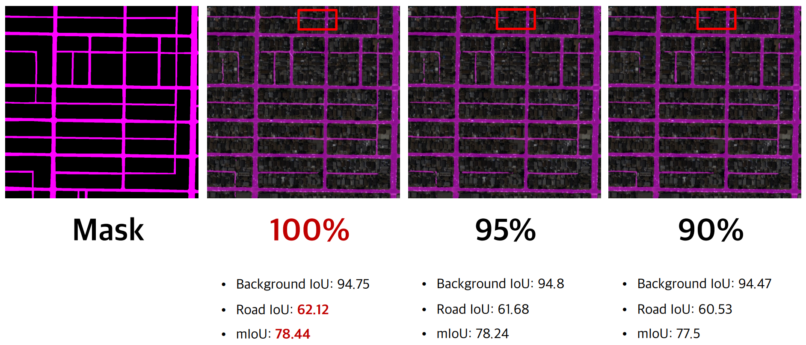

 

### 3.3 Loss Function research

- EDA를 통해 데이터셋이 가진 Class Imbalance 문제를 발견
- Loss Function 변경하여, Minor class의 Loss에 더 큰 가중치를 주는 방법인 Re-weighting 에 집중
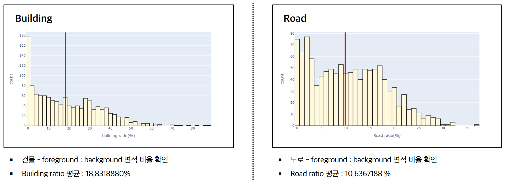

### **_Building_**

- 각 회차별 best 결과 확인 (5회 X 5명, 총 25회 진행)

    | case | loss function | IoU | mIoU | model | loss weight | class weight | alpha |
    | --- | --- | --- | --- | --- | --- | --- | --- |
    | 1 | C.E loss | 83.09 | 88.24 | HRNet | 1.0 | [0.5, 1.0] | |
    | 2 | C.E loss | 82.89 | 88.02 | HRNet | 1.0 | [0.3, 0.7] | |
    | 3 | Focal loss | 81.94 | 87.53 | HRNet | 1.0 | None | |
    | 4 | C.E + Lovasz loss | 83.49 | 88.51 | HRNet | 0.8, 0.2 | [0.5, 1.0] | 0.8 |
    | 5 | Lovasz loss | 83.33 | 88.47 | HRNet | 1.0 | [0.3, 0.7] | |

- **Inference**

 

### **_road_**

- 각 회차별 best 결과 확인 (5회 X 5명, 총 25회 진행)

    | case | loss function | IoU | mIoU | model | loss weight | class weight | alpha |
    | --- | --- | --- | --- | --- | --- | --- | --- |
    | 1 | C.E loss | 62.87 | 78.64 | SegFormer | 1.0 | [0.5, 1.0] | |
    | 2 | C.E loss | 62.53 | 78.42 | SegFormer | 1.0 | [0.3, 0.7] | |
    | 3 | Focal loss | 63.04 | 78.93 | SegFormer | 1.0 | [0.5, 1.0] | 0.2 |
    | 4 | Focal + Lovasz loss | 63.7 | 79.28 | SegFormer | 0.8, 0.2 | [0.5, 1.0] | 0.8 |
    | 5 | Focal + Lovasz loss | 63.66 | 79.25 | SegFormer | 0.8, 0.2 | [0.5, 1.0] | 0.2 |

- **Inference**

### **_Result of Loss Function research_**

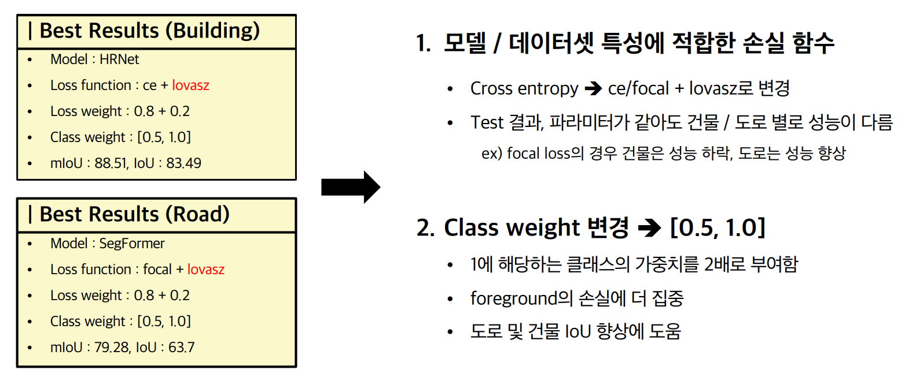

 

### 3.4 Road Contour
- Road Contour 실험목적 : Road Segmentation 성능 향상
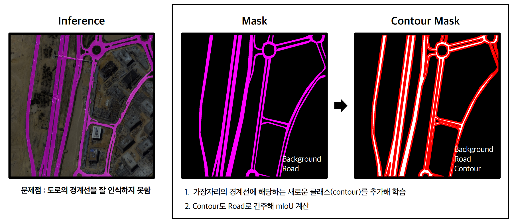

- **Inference**
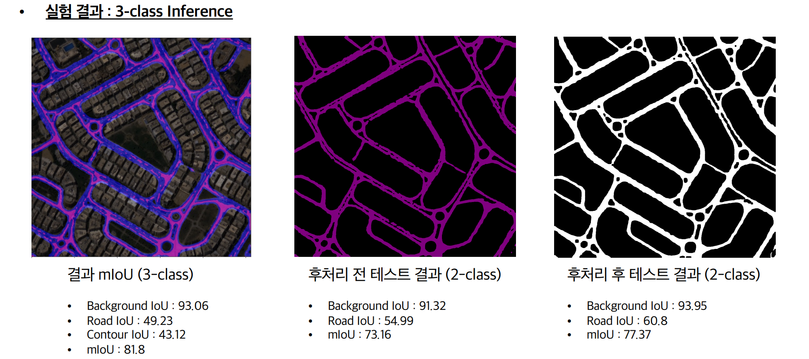

    - 도로 영역이 전반적으로 두껍게 검출됨
    - 폭이 얇은 두 도로의 경우 하나의 넓은 도로로 검출됨
    - 테두리가 울퉁불퉁하게 검출되는 부분은 확실히 완화 되었으나, 도로가 더 두꺼워져 성능이 오히려 저하됨

### **_Result of Road Contour_**

- Inference 확인 결과, 도로 사이의 간격이 좁은 경우 contour를 그리면서 위처럼 도로 사이의 틈이 contour의 두께에 뒤덮여
소실되는 경우가 다수 발생
- erosion 알고리즘은 위의 경우 폭이 넓은 한 덩어리의 도로로 인식하기 때문에, 도로 사이에 빈 background 검출 어려움

 

### 3.5 Upsampling

- Upsampling : Pooling 레이어를 거치면서 축소된 피처맵을 원본 이미지의 크기로 되돌리기 위해서 사용하는 방법. 단순히 이미지 형태를 유지하면서 픽셀 행/열 수 또는 둘다 늘리는 방법으로 공간 해상도를 증가시키는 것을 뜻함.
- 이미지의 적당한 해상도는 작은 공간을 추출할 때 상당한 문제 → Upsampling을 통해 성능 향상기대
- Super Resolution으로 upsampling 후 patch size를 조절해 학습
    - SRGAN : GAN 모델은 해상도가 향상되나 의도치 않은 artifacts 발생 및 원본의 특성이 훼손될 우려로 부적합하다고 판단
    - FSRCNN : upsampling 결과가 비슷한 다른 모델에 비해 처리 속도가 빨라서 실험에 적합하다고 판단
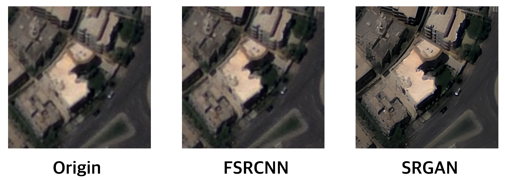

### **_Building_**

### **_road_**
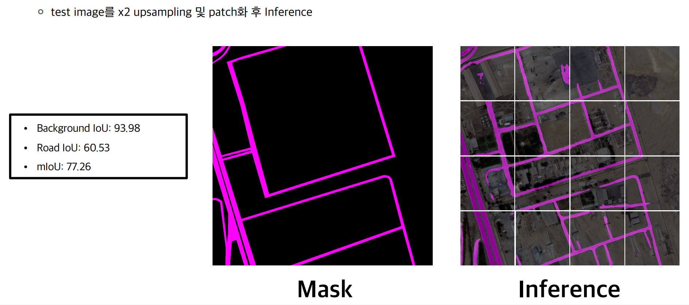

### **_Result of Upsampling_**
- Dramatic하게 성능이 높아지진 않았음
- SpaceNet 7 데이터셋은 건물 및 도로의 크기가 작아 upsampling의 효과를 본 것으로 보임
- 반면 아리랑 데이터셋은 건물 및 도로가 비교적 크기에 효과가 적은 것으로 추정

 

### 3.6 Test data 분석

### **_Building_**
- Labeling problem
    - 육안 상 건물로 보이고, 모델도 건물로 예측한 부분이 정답 label에는 없음
    - 건물로 판단하는 기준이 모호하고 일관성이 부족함 → Noisy Label
        - 어느 정답 label에서는 건물로 masking되어 있지만, 다른 labeld에는 masking이 없음.
        - 우리의 모델을 이 건물을 잘 인식하도록 oversampling하더라도, 평가 시 정답지에 이 건물에 대한 masking이 없는 경우도 있기 때문에 IoU는 하락할 것임.
    - 이미지 가장자리에 위치한 건물들의 정답 label이 누락된 경우가 많음

 

### **_road_**
- Labeling problem
    - 건물과 건물 사이 도로인데 정답 label에는 없음, 일관성이 없음
    - 비포장 도로, 주차장, 활주로 등 경우에 따라 정답 label이 없음, 일관성이 없음 → Noisy Label
    - 하나의 사진 내에서 도로로 masking된 비포장도로도 있고, 그렇지 않은 비포장도로도 있음
    - 모델 또한 이러한 이유로 inference 를 잘 못함.

### **_Result of Test Data Analysis_**

- Noisy Label
    - 위성영상에서 Noisy Label의 문제는 항상 내재하며 판독관에 따라 건물 혹은 도로에 대한 정의가 다를 수 있기에 발생
    - 라벨링 과정에서 상이한 판단기준을 조정하고 일관된 라벨을 생성하도록 노력하나 비일관성을 완전히 제거하기 어려움
    - 이 문제는 건물보다 도로에 대한 라벨링 과정에서 극대화될 수 있음
- 위성영상 모델 성능 향상
    - Data-Driven 접근방식을 흔히 채택
    - 유사한 Task의 데이터셋을 학습과정에 함께 사용하면 모델의 일반화 성능 향상 가능 → DeepGlobe 데이터셋 추가 실험

 

### 3.7 DeepGlobe 데이터셋 추가

- DeepGlobe
    - 2018년 Satellite Image Understanding Challenge
    - 3가지 Challenge Tracks 중 Road Extraction Challenge Dataset을 추가하여 실험
    - DeepGlobe 데이터의 GSD(Ground Sampling Distance)는 0.5m 
    - 6226장의 train image 존재
    - data를 추가하여 Robust하게 만듦을 목적으로 함.

### **_Result of adding DeepGlobe Data_**
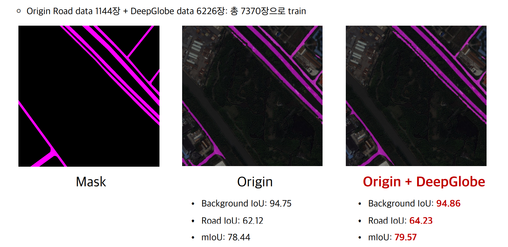

 

### 3.8 Post-processing

- Level1 Inference 결과 확인 -> 도로 끊김, 노이즈 문제 발견
- 결과에 대해 후처리를 하기 위해 모폴로지(Morphology)연산을 이용
- 모폴로지(Morphology) 
    - 전처리(pre-processing) 또는 후처리(post-processing) 에 널리 사용되는 형태학적 연산
    - 닫힘(팽창 후 침식), 열림(침식 후 팽창) 연산 등이 있음

### **_Result of Post-processing_**

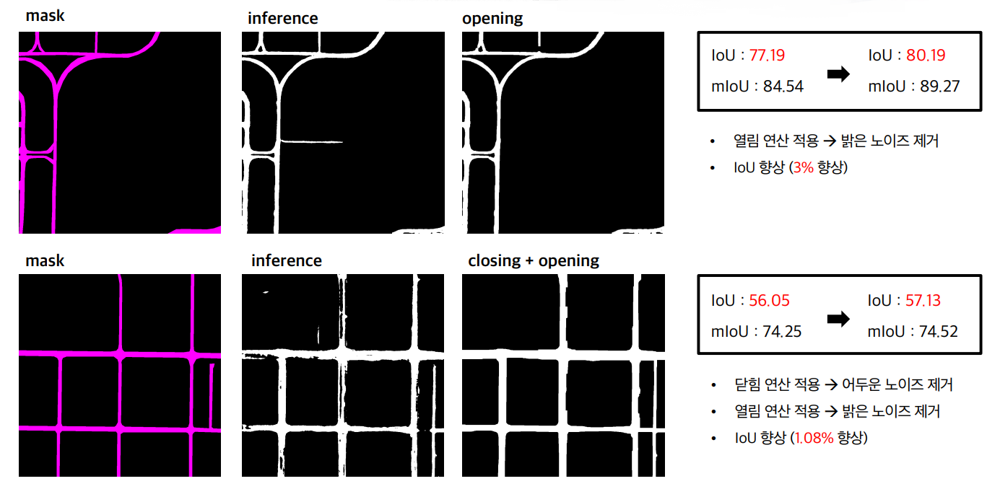

 

## 4. Level2 건물의 객체검출을 위한 학습을 수행

### 4.1 Overview
- 위성영상분석의 목적은 시각적으로 향상된 분석결과를 제공
- 건물 간 ID를 부여할 수 있도록 독립된 객체로 분리하거나, 분리된 결과가 도출되어야 함
- 위성영상으로부터 관찰된 건물은 밀집되어 건물 객체 간 시각적 분리가 어려울 수 있기에, 딥러닝 모델은 건물과 건물 사이
불확실성이 높은 부분을 건물로 판단해버릴 수 있음
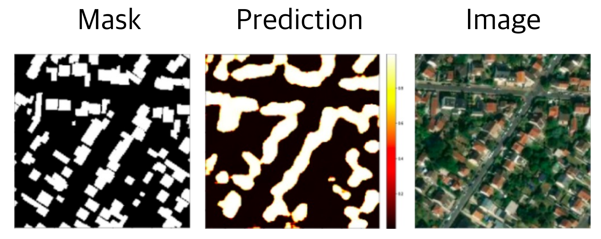
    - 건물 경계를 매우 정확하게 감지하지 못하는 한계
    - 날카로운 모서리 대신 부드러운 모서리를 예측
    - 건물이 가까이 있는 인구 밀집 지역에서 특히 문제

- Building Instance Segmentation을 위해 인스턴스 분할을 위해서는 동일한 객체의 주변 항목을 분리하는 것이 필수

 

### 4.2 Pre-processing
- 객체 간 구분을 용이하게 하기 위하여 객체의 경계 부분인 Edge(Contour) 클래스 추가
- 인접한 객체를 분할하여 Instance 생성에 초점
- Edge(Contour) 클래스는 3pixel로 masking

> classes = (‘background’, ‘building’, ‘edge’), palette = [[0, 0, 0], [0, 0, 255], [255, 0, 0]]

 

### 4.3 Modeling

- Background, Building, Edge (Contour) 모델 학습 진행
- 학습 후 Inference 결과에서 Edge Class를 Background Class로 변경

### **_Result of Building Instance Segmentation_**
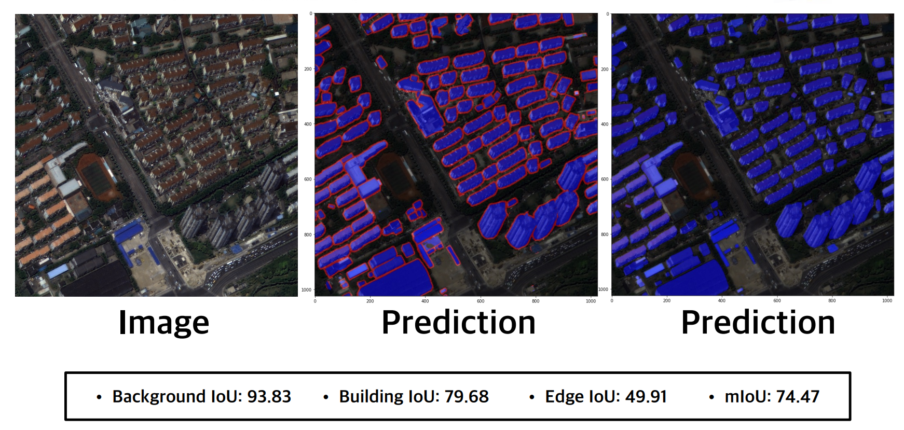

 

## 5. Level3 건물의 크기와 개수를 계산할 수 있도록 LV2결과를 이용해 Polygon형태로 나타내고 지도에 매핑

### 5.1 Polygonization
- Semantic Segmentation 기반 Polygonization

-  Level 2의 Inference 결과 (위성 영상 + segmentation map)에서 polygonize를 수행하기 위해 segmentation map만 추출

- Shapely 패키지
    - 평면 기하학적 객체의 조작 및 분석을 위한 파이썬 패키지 → 이를 이용해 segmentation map을 polygonize
    - cv2 라이브러리의 findContours()와 Shapely 패키지의 Polygon()으로 건물의 polygon 생성

- 모델이 Inference한 결과이기에 건물 polygon의 경계면이 매끄럽지 못한 경우가 존재 -> RDP 알고리즘 이용
- Ramer-Douglas-Peucker algorithm (1973)

    - line 혹은 polygon을 나타나는데 필요한 point 수를 줄이는 알고리즘
    - 원본보다 적은 point의 polyline을 생성하지만 특성과 모양을 유지
    - 지도 렌더링 속도 향상, IoT 장치 간 통신 개선 등에 적용

### **_Result of RDP_**
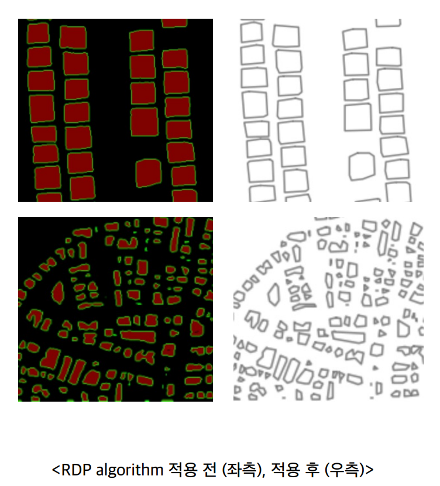

 

### 5.2 Transforming Coordinates
- 현재 각 polygon들의 좌표는 1024 x 1024 사이즈의 이미지 내에서 pixel 좌표로 표현 → 실제 지구 좌표계로 변환 필요
- Rasterio 패키지
    - 지리 공간 raster 데이터 읽기 및 쓰기
    - 지리 정보 시스템은 GeoTIFF 및 기타 형식을 사용해 grid 혹은 raster 데이터셋을 구성하고 저장
    - Rasterio는 이러한 형식을 읽고 쓰고 ndarray를 기반으로 하는 Python API를 제공
- Rasterio 패키지로 tif 파일을 로드해 위성 영상의 bounds (상하좌우 좌표) 및 CRS (지리 좌표계) 추출
    - bounds를 기준으로 앞서 생성한 polygon들의 geometry 재계산
    - 위성 영상마다 CRS가 다른 경우가 존재 → 각 위성 영상에서 추출한 CRS로 좌표 변환 수행
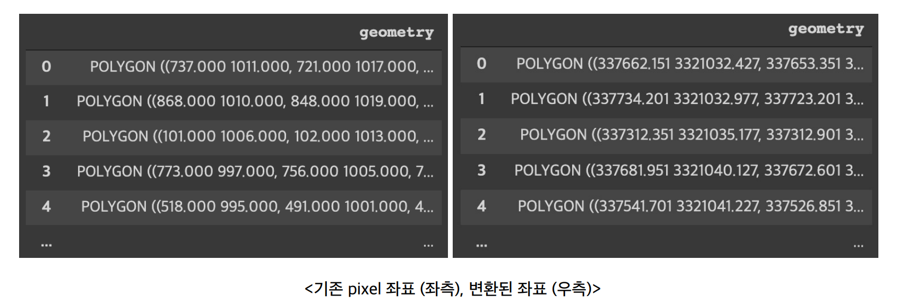

- 좌표가 변환된 polygon들이 포함된 GeoDataFrame을 shp 파일로 저장

 

### 5.3 Mapping

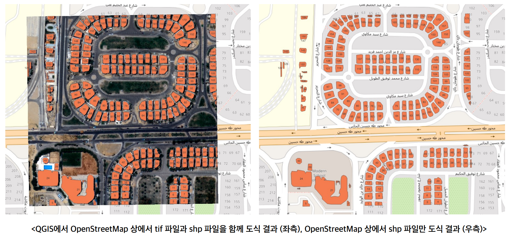
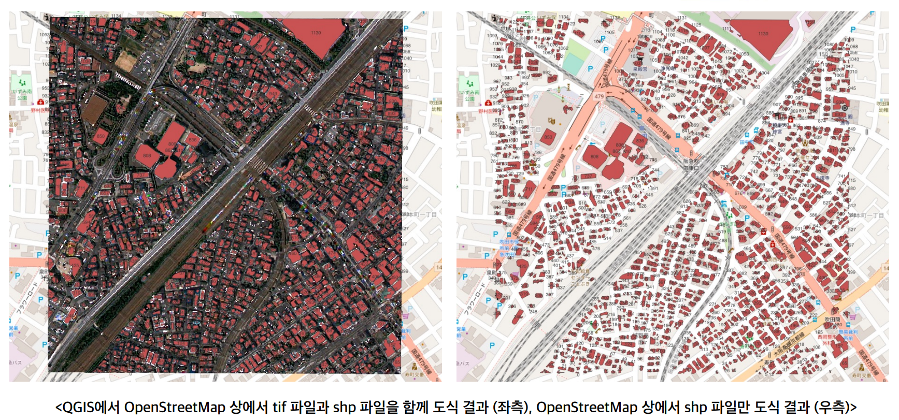

 

## 6. 프로젝트 회고

| 
이름
 | 회고 |
| :--------: | :---------------------------- | 
| 황무성 | 프로젝트를 통해 Segmentation Task를 한층 더 깊이 이해하게 되어서 좋았고, 위성사진이 다양한 분야에서 응용될 수 있다는 것을 느꼈습니다. 또한 여기서 멈추지 않고 건물과 도로를 더 잘 검출할수있는 방법론을 추후 찾아보고 싶고, 뿐만아니라 관심객체, 구름, 수계검출 프로젝트를 해보고 싶습니다.  | 
| 배재현 | 위성영상이 굉장히 다양한 분야에 활용되고 있다는 것이 놀라웠고, Segmentation Task에 대해 공부가 된 것 같아 좋았습니다. | 
| 권다현 | 평소 관심있던 Segmentation Task를 깊게 수행해 볼 수 있는 기회여서 좋았습니다! 5주 동안 쉬지 않고 달려온 우리 팀원들 최고 ~~~~~ ❤ | 
| 양창민 | 딥러닝을 배우고 처음 접한 Segmentation 프로젝트라서 힘들었지만, 잊지 못할 추억을 얻었습니다. 다들 고생하셨습니다! |
| 남궁재원 | dobby is free. |
