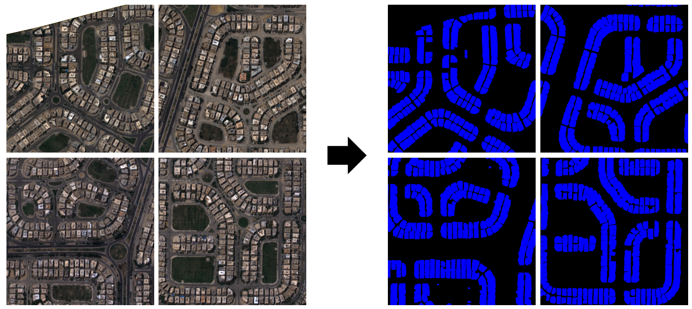
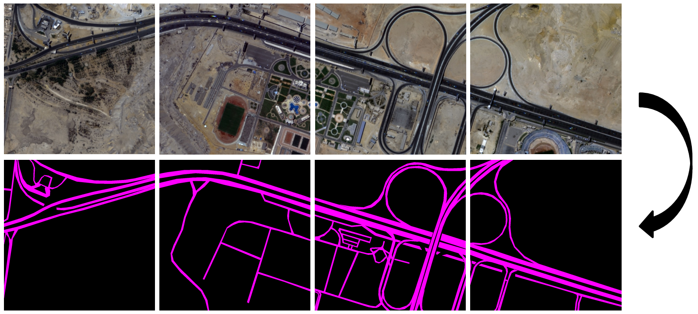
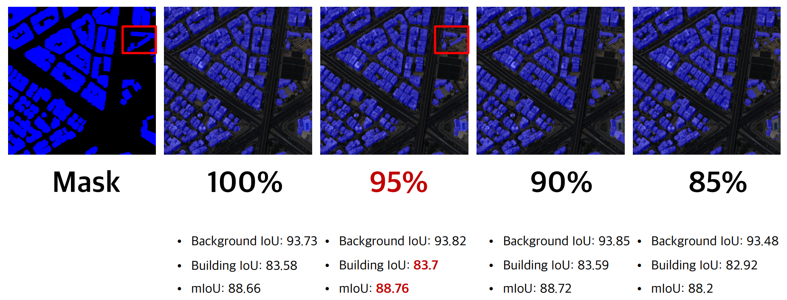
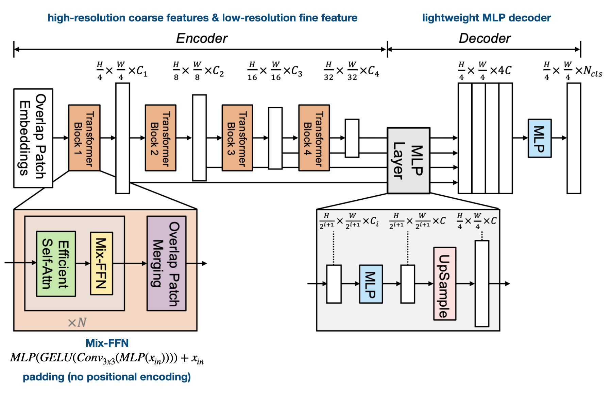
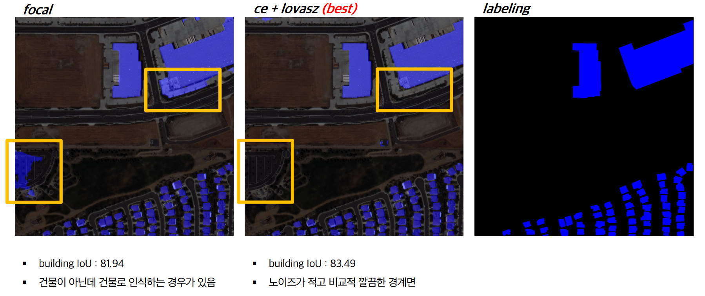
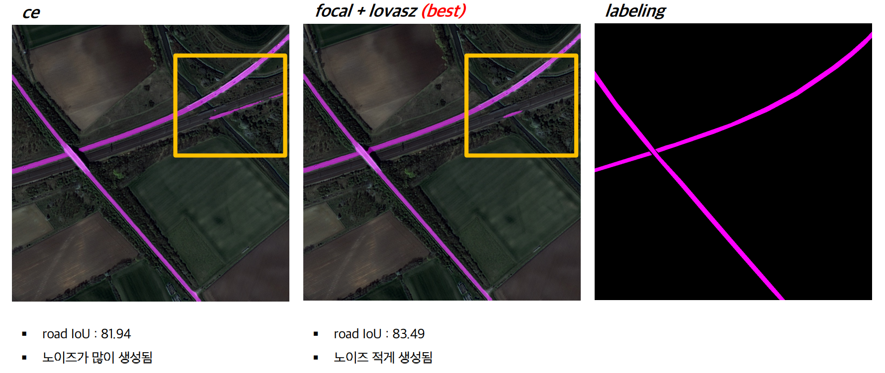

# AIFFEL X SIA PROJECT
* 모두의연구소 산하 인공지능 교육기관 AIFFEL과 인공지능 기반 위성/항공 영상 분석 전문기업 SI Analytics가 협력하여 진행된 기업 연계 해커톤 프로젝트로서, [위성영상 객체분할을 위한 의미론적 분할 기술] 주제에 대해 SIA로 부터 제공 받은 위성 데이터를 기반으로 프로젝트를 진행하였습니다.

 

## 1. 프로젝트 소개

### 1.1 개요
- 주제 : **위성영상 객체분할을 위한 의미론적 분할 기술**  
- 기간 : 2021.04.25(월)  ~ 2021.06.09(목)  
- 방식 : 팀 프로젝트
- Keyword : 의미론적 분할 (Semantic segmentation), Instance segmentation
- 배경
    * 의미론적 분할(Semantic Segmentation)은 위성으로부터 관찰되는 특정픽셀을 분류하는 방법으로써 전통적으로 많은 연구가 수행됨.
    * 인공지능 분석결과를 육안으로 분석해야하는 한계를 넘기 위해 Instance Segmentation 분석 수요 증가.
    * 객체의 ID가 구분되는 Instance Segmentation은 향후 고차원적인 분석방법을 지원.

 

### 1.2 프로젝트 목표
- 위성 영상에서 건물과 도로를 식별하고 객체를 분할한다.
    - 건물, 도로 각각 Semantic Segmentation
- 레벨별 스텝
    - [LV1] 건물과 도로를 각각 검출하고 결과를 합쳐서 분석한다. (일반 ★☆☆☆☆)
    - [LV2] 건물의 객체검출을 위한 학습을 수행한다. (어려움 ★★☆☆☆)
    - [LV3] 건물의 크기와 개수를 계산할 수 있도록 LV2결과를 이용해 Polygon형태로 나타내고 지도에 매핑한다. (일반 ★★☆☆☆)

 

### 1.3 구성원 
| 이름 | 구성 | 역할 |
| :-----: | :-----: | :----------------------------: | 
| 황무성 | 팀장 | 프로젝트 총괄, pre-processing, Road Segmentation 모델링, Instance Segmentation 모델링, 결과 분석 | 
| 배재현 | 부팀장 | 일정 관리, pre-processing, Building Segmentation 모델링, 결과 분석, GIS Mapping, GCP 운용 | 
| 권다현 | 팀원 | EDA, post-processing, Loss Function 비교 분석 | 
| 양창민 | 팀원 | SpaceNet 자료조사, post-processing, Upsampling |
| 남궁재원 | 팀원 | EDA, Road Contour 모델링 |

 

### 1.4 기술 스택
- Pytorch, MMSegmentation, OpenCV, PIL, QGIS, Pandas, numpy, Matplotlib, Seaborn 외

 

## 2. 데이터 정의 및 EDA

### 2.1 데이터셋 정의
- 아리랑 3A호 (KOMPSAT-3A)에서 취득한 위성영상 패치
    - Scene형태의 영상을 AI를 위해서 1024 크기의 패치로 자른 형태
    - RGB3채널로 생성된 영상 활용
    - GSD(GroundSampleDistance):0.55m
    - 같은 장소영상에 대해 KML,PNG,TIF타입 등으로 총 3개 제공
    - 패치 개수: 건물, 도로 ­ 동일 이름은 확장자가 달라도 1개로 취급
- Label
    - 건물은 JSON,PNG타입으로 총 2개씩 제공
    - 도로는 JSON타입 1개만 제공
- 데이터셋 및 타입에 대한 설명 참조
    - https://aihub.or.kr/aidata/7982
    - https://mangomap.com/gis-data

 

### 2.2 데이터 분석(EDA)

 

## 3. Level1 건물과 도로를 각각 검출하고 결과를 합쳐서 분석

### 3.1 Pre-processing
- 위성 영상마다 각각의 json 파일에 건물의 polygon 좌표가 존재 → 좌표를 토대로 masking
- 너무 작게 보여 식별이 힘든 컨테이너 박스, 기타 건물 class는 제외하고 masking

### **_Building_**
> classes = (‘background’, ‘building’), palette = [[0, 0, 0], [0, 0, 255]]

 

### **_road_**
> classes = (‘background’, ‘road’), palette = [[0, 0, 0], [255, 0, 255]]

 

### 3.2 Modeling

### **_Building_**
- **Model** : HRNet(Deep High-Resolution Representation Learning
for Visual Recognition)
    - Human Pose Estimation 분야에서 SOTA 모델을 달성한 모델로 2019년 발표됨.
    - HRNet은 high-resolution representations를 전체 process 동안 유지하는 특징을 가지므로 모델 선정

- **Train**
    - 건물 면적이 50% 이상인 위성 영상은 적고, 평균적으로 20 ~ 30% 대 이기때문에, 건물 비율 100%, 95%, 90%, 85%에 대해 각각 모델 학습 진행
    - 학습 후 Building IoU 및 Inference 결과 비교

- **Inference**

 

### **_road_**

- **Model** : SegFomer(Simple and Efficient Design for Semantic Segmentation with Transformers)
    - encoder 와 decoder 모두에 transformer를 사용하여 efficiency, accuracy, robustness를 모두 고려한 모델
    - Semantic Segmenation의 경우 context 정보를 포함하도록 large receptive field를 유지하는 것이 핵심 문제인데, Hierarchical Transformer 계층적인 구조가 encoder의 핵심부분으로 CNN과 같이 high-resolution coarse feature와 low resolution fine feature 모두를 생성할 수 있도록 구성했으며, 타 모델에 비해 receptive field가 훨씬 크기때문에 모델 선정

- **Train**
    - 도로 면적이 30% 이상인 위성 영상은 적고, 평균적으로 10 ~ 15% 대 이기때문에, 도로 비율 100%, 95%, 90%에 대해 각각 모델 학습 진행
    - 학습 후 Road IoU 및 Inference 결과 비교

- **Inference**

 

### 3.3 Loss Function research

- EDA를 통해 데이터셋이 가진 Class Imbalance 문제를 발견
- Loss Function 변경하여, Minor class의 Loss에 더 큰 가중치를 주는 방법인 Re-weighting 에 집중

### **_Building_**

- 각 회차별 best 결과 확인 (5회 X 5명, 총 25회 진행)

    | case | loss function | IoU | mIoU | model | loss weight | class weight | alpha |
    | --- | --- | --- | --- | --- | --- | --- | --- |
    | 1 | C.E loss | 83.09 | 88.24 | HRNet | 1.0 | [0.5, 1.0] | |
    | 2 | C.E loss | 82.89 | 88.02 | HRNet | 1.0 | [0.3, 0.7] | |
    | 3 | Focal loss | 81.94 | 87.53 | HRNet | 1.0 | None | |
    | 4 | C.E + Lovasz loss | 83.49 | 88.51 | HRNet | 0.8, 0.2 | [0.5, 1.0] | 0.8 |
    | 5 | Lovasz loss | 83.33 | 88.47 | HRNet | 1.0 | [0.3, 0.7] | |

- **Inference**

### **_road_**

- 각 회차별 best 결과 확인 (5회 X 5명, 총 25회 진행)

    | case | loss function | IoU | mIoU | model | loss weight | class weight | alpha |
    | --- | --- | --- | --- | --- | --- | --- | --- |
    | 1 | C.E loss | 62.87 | 78.64 | SegFormer | 1.0 | [0.5, 1.0] | |
    | 2 | C.E loss | 62.53 | 78.42 | SegFormer | 1.0 | [0.3, 0.7] | |
    | 3 | Focal loss | 63.04 | 78.93 | SegFormer | 1.0 | [0.5, 1.0] | 0.2 |
    | 4 | Focal + Lovasz loss | 63.7 | 79.28 | SegFormer | 0.8, 0.2 | [0.5, 1.0] | 0.8 |
    | 5 | Focal + Lovasz loss | 63.66 | 79.25 | SegFormer | 0.8, 0.2 | [0.5, 1.0] | 0.2 |

- **Inference**

### 3.4 Contour

### 3.5 Upsampling

### 3.6 Test data 분석

### 3.7 DeepGlobe 데이터셋 추가

### 3.8 Post-processing

## 4. Level2 건물의 객체검출을 위한 학습을 수행

### 4.1 Pre-processing

### 4.2 Modeling

## 5. Level3 건물의 크기와 개수를 계산할 수 있도록 LV2결과를 이용해 Polygon형태로 나타내고 지도에 매핑

### 5.1 QGIS